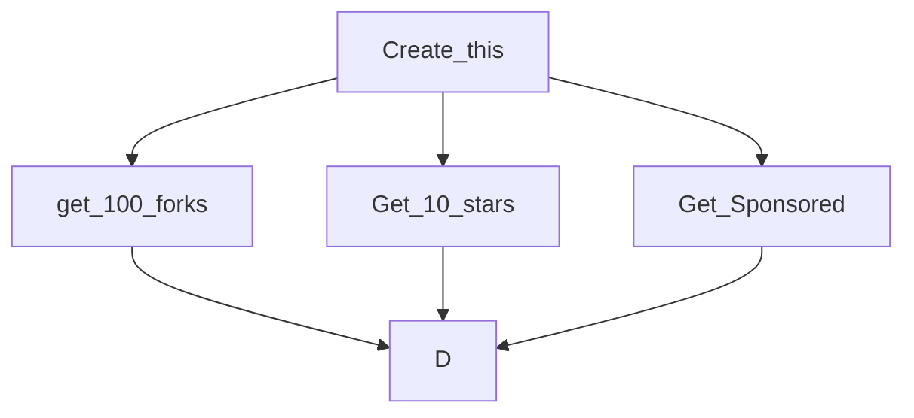
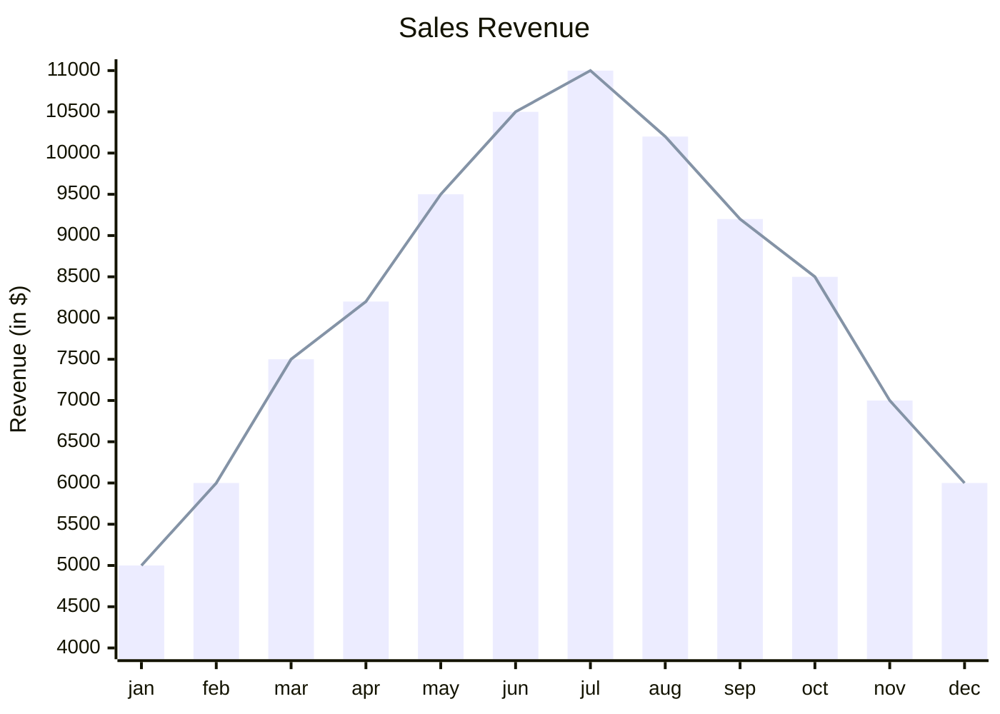

# cool-markdown
Vanilla Markdown Tricks For Much Better README Files, everything you need 

### todo
- [x] vanilla MD
- [ ] with jekyll
- [ ] cool non-vanilla MD but using fancy recourses, not the typical crap.
- [ ] profile/project README examples
- [ ] simple online editor as github page
- [ ] Future: tiny details README (such as social link decoration, ability to change font)
- [ ] add valuable resources list that has readme thingies to add (like shields and other real-time data viewing UIs)
- [ ] Make a file that has README rules to make the file attractive and informative

# Tricks

## permanent link to a code snippet
[**How To Get a Link**](https://docs.github.com/en/get-started/writing-on-github/working-with-advanced-formatting/creating-a-permanent-link-to-a-code-snippet)  
```
https://github.com/USERNAME/REPOSITORY/blob/COMMIT_HASH/FILENAME?plain=1#LX-LX
```
> LX - LX  == line range, written like this (exmp) : L3-L11

https://github.com/eymeen/cool-markdown/blob/1279864b0306ea9cf597553d47389276727bf987/README.md?plain=1#L11-L22

## Alerts
> [!NOTE]
> Useful information that users should know, even when skimming content.

> [!TIP]
> Helpful advice for doing things better or more easily.

> [!IMPORTANT]
> Key information users need to know to achieve their goal.

> [!WARNING]
> Urgent info that needs immediate user attention to avoid problems.

> [!CAUTION]
> Advises about risks or negative outcomes of certain actions.
## Todo Special
- [x] #1
- [ ] https://github.com/eymeen/cool-markdown/issues/1
- [ ] https://github.com/eymeen/cool-markdown/pulls/1
- [ ] Add delight to the experience when all tasks are complete

## Yaml, [jekyll](https://github.com/jekyll/jekyll-gist)
Although this is not considered 100% vanilla, but it's something you can do in github, and it will enable you to make better stuff in the MD. 
## embed gists
```

```
``

## embed repos
[](https://github.com/eymeen/cool-markdown)


## Diagrams
you can create [here](https://mermaid.live/edit) and paste it in the MD file

### Simple

### 

### geojson Maps
```geojson
{
  "type": "FeatureCollection",
  "features": [
    {
      "type": "Feature",
      "id": 1,
      "properties": {
        "ID": 0
      },
      "geometry": {
        "type": "Polygon",
        "coordinates": [
            [
                [37.85, 36.2],
                [37.85, 36.15],
                [37.9, 36.15],
                [37.95, 36.18],
                [37.9, 36.2],
                [37.85, 36.2]
            ]
        ]
      }
    }
  ]
}
```
### topojson Maps 
```topojson
{
  "type": "Topology",
  "transform": {
    "scale": [0.0005000500050005, 0.00010001000100010001],
    "translate": [100, 0]
  },
  "objects": {
    "example": {
      "type": "GeometryCollection",
      "geometries": [
        {
          "type": "Point",
          "properties": {"prop0": "value0"},
          "coordinates": [4000, 5000]
        },
        {
          "type": "LineString",
          "properties": {"prop0": "value0", "prop1": 0},
          "arcs": [0]
        },
        {
          "type": "Polygon",
          "properties": {"prop0": "value0",
            "prop1": {"this": "that"}
          },
          "arcs": [[1]]
        }
      ]
    }
  },
  "arcs": [[[4000, 0], [1999, 9999], [2000, -9999], [2000, 9999]],[[0, 0], [0, 9999], [2000, 0], [0, -9999], [-2000, 0]]]
}
```
## 3D Models
```stl
solid cube_corner
  facet normal 0.0 -1.0 0.0
    outer loop
      vertex 0.0 0.0 0.0
      vertex 1.0 0.0 0.0
      vertex 0.0 0.0 1.0
    endloop
  endfacet
  facet normal 0.0 0.0 -1.0
    outer loop
      vertex 0.0 0.0 0.0
      vertex 0.0 1.0 0.0
      vertex 1.0 0.0 0.0
    endloop
  endfacet
  facet normal -1.0 0.0 0.0
    outer loop
      vertex 0.0 0.0 0.0
      vertex 0.0 0.0 1.0
      vertex 0.0 1.0 0.0
    endloop
  endfacet
  facet normal 0.577 0.577 0.577
    outer loop
      vertex 1.0 0.0 0.0
      vertex 0.0 1.0 0.0
      vertex 0.0 0.0 1.0
    endloop
  endfacet
endsolid
```
## videos
<video src="https://github.com/rayytsn9/ROBOTT/assets/79029536/62f541aa-aa8c-43f5-9ead-4b7a2e0d7c2a" width="300" />

## Math
$`\sqrt{3x-1}+(1+x)^2`$ $`Or`$ $`Just`$ $`This`$ $`Cool`$ $`Font`$

## Math Blocks
**The Cauchy-Schwarz Inequality**
$$\left( \sum_{k=1}^n a_k b_k \right)^2 \leq \left( \sum_{k=1}^n a_k^2 \right) \left( \sum_{k=1}^n b_k^2 \right)$$
