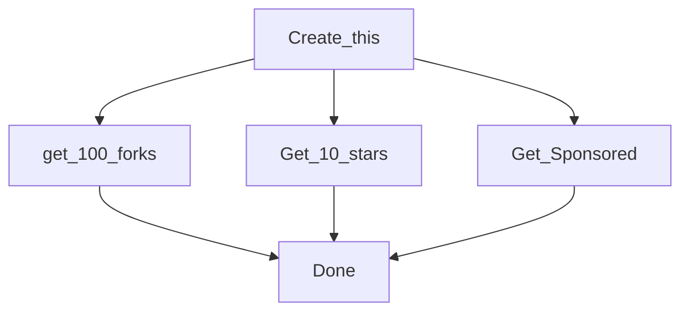

# cool-markdown
Vanilla Markdown Tricks For Much Better README Files, everything you need 

---

## index (so you don’t scroll like crazy)

| Category | Feature | Link |
| :--- | :--- | :--- |
| **Navigation** | Todo & Rules | [#todo](#todo) |
| **Text & UI** | Alerts & Collapsibles | [#alerts](#alerts) / [#collapsible-sections](#collapsible-sections) |
| **Code** | Permalinks & Diffs | [#permanent-link-to-a-code-snippet](#permanent-link-to-a-code-snippet) / [#diff-highlighting](#diff-highlighting) |
| **Advanced** | Diagrams, Maps, & 3D | [#diagrams](#diagrams) / [#maps](#maps) / [#3d-models](#3d-models-slightly-less-ugly-now) |
| **Media** | Videos & Math | [#videos](#videos) / [#math](#math) |
| **Other** | Jekyll & Footnotes | [#yaml-jekyll](#yaml-jekyll) / [#footnotes](#footnotes) |

---

### todo
- [x] vanilla MD
- [x] with jekyll
- [x] cool non-vanilla MD but using fancy resources
- [x] profile/project README examples
- [x] simple online editor as github page
- [ ] Future: tiny details README (such as social link decoration, ability to change font)
- [x] add valuable resources list that has readme thingies to add
- [x] Make a file that has README rules to make the file attractive and informative

---

# Tricks

## Collapsible Sections
Great for hiding huge logs, long code blocks, or "deep dives" that clutter the main page.

<details>
<summary>▶ Click to expand</summary>

You can put anything here, even images or other markdown.
</details>

---

## Diff Highlighting
Show exactly what changed. Useful for tutorials or explaining bug fixes.

```diff
- const status = 'boring';
+ const status = 'cool-markdown';
````

-----

## permanent link to a code snippet

[**How To Get a Link**](https://docs.github.com/en/get-started/writing-on-github/working-with-advanced-formatting/creating-a-permanent-link-to-a-code-snippet)

```
[https://github.com/USERNAME/REPOSITORY/blob/COMMIT_HASH/FILENAME?plain=1#LX-LX](https://github.com/USERNAME/REPOSITORY/blob/COMMIT_HASH/FILENAME?plain=1#LX-LX)
```

> LX-LX = line range (ex: L3-L11)

example:
https://github.com/eymeen/cool-markdown/blob/1279864b0306ea9cf597553d47389276727bf987/README.md?plain=1\#L11-L22

-----

## Alerts

> [\!NOTE]
> Useful info even if you're skimming

> [\!TIP]
> makes life easier

> [\!IMPORTANT]
> don’t skip this one

> [\!WARNING]
> this will bite you later

> [\!CAUTION]
> yeah... risky

-----

## Todo Special

  - [x] \#1
  - [ ] https://github.com/eymeen/cool-markdown/issues/1
  - [ ] https://github.com/eymeen/cool-markdown/pulls/1
  - [x] Add delight to the experience when all tasks are complete

when all done:

```
🎉 everything done, go touch grass
```

-----

## Yaml, jekyll

Although not 100% vanilla, GitHub Pages lets you do some nice stuff.

```yaml
---
title: cool-markdown
description: markdown tricks
---
```

you can:

  - reuse components
  - loop stuff
  - inject variables
  - basically treat markdown like a mini app

-----

## embed gists

The `<script>` method doesn't work in README files for security reasons. Best bet is to link it or use a screenshot.

[View my Gist here](https://gist.github.com/)

-----

## embed repos

This one actually works fine, just needed a proper example:

[](https://github.com/eymeen/cool-markdown)

-----

## Diagrams

you can create here https://mermaid.live/edit

### Simple


```mermaid
graph TD;
    Create_this-->Get_Sponsored;
    Create_this-->Get_10_stars;
    Create_this-->get_100_forks;
    get_100_forks-->Done;
    Get_10_stars-->Done;
    Get_Sponsored-->Done;
```

-----

## Maps

### geojson (Palestine Region)

```geojson
{
  "type": "FeatureCollection",
  "features": [
    {
      "type": "Feature",
      "properties": { "name": "Al Quds" },
      "geometry": {
        "type": "Polygon",
        "coordinates": [
          [[35.1, 31.7], [35.3, 31.7], [35.3, 31.9], [35.1, 31.9], [35.1, 31.7]]
        ]
      }
    }
  ]
}
```

### topojson (Mecca Area)

```topojson
{
  "type": "Topology",
  "objects": {
    "area": {
      "type": "GeometryCollection",
      "geometries": [
        {
          "type": "Polygon",
          "arcs": [[0]],
          "properties": { "name": "Mecca Region" }
        }
      ]
    }
  },
  "arcs": [
    [[39.8, 21.3], [39.9, 21.3], [39.9, 21.4], [39.8, 21.4], [39.8, 21.3]]
  ]
}
```

-----

## 3D Models (slightly less ugly now)

```stl
solid pyramid
  facet normal 0 0 1
    outer loop
      vertex 0 0 0
      vertex 1 0 0
      vertex 0.5 0.5 1
    endloop
  endfacet
  facet normal 0 1 0
    outer loop
      vertex 1 0 0
      vertex 1 1 0
      vertex 0.5 0.5 1
    endloop
  endfacet
  facet normal 0 0 -1
    outer loop
      vertex 1 1 0
      vertex 0 1 0
      vertex 0.5 0.5 1
    endloop
  endfacet
  facet normal -1 0 0
    outer loop
      vertex 0 1 0
      vertex 0 0 0
      vertex 0.5 0.5 1
    endloop
  endfacet
endsolid
```

-----

## videos

\<video src="https://github.com/rayytsn9/ROBOTT/assets/79029536/62f541aa-aa8c-43f5-9ead-4b7a2e0d7c2a" width="300" /\>

-----

## Math

$`\sqrt{3x-1}+(1+x)^2`$

## Math Blocks

$$\left( \sum_{k=1}^n a_k b_k \right)^2 \leq \left( \sum_{k=1}^n a_k^2 \right) \left( \sum_{k=1}^n b_k^2 \right)$$

-----

## Footnotes

Perfect for adding citations without breaking the flow of your text[^1].

-----

## resources (actually useful)

  - https://github.com/anuraghazra/github-readme-stats
  - https://shields.io
  - https://readme-typing-svg.herokuapp.com
  - https://mermaid.live
  - https://carbon.now.sh

-----

## README rules (personal opinion)

  - don’t make it a wall of text
  - people scan, not read
  - visuals \> paragraphs
  - don’t overdo animations (please)
  - make it useful, not just “cool”

-----

will keep adding random stuff here when I find something worth it


[^1]:
    This is the text for the footnote.
