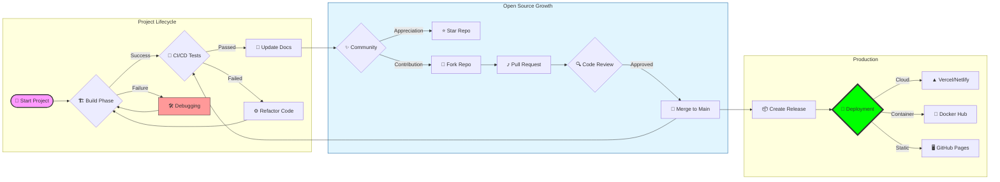

# cool-markdown
Vanilla Markdown Tricks For Much Better README Files. Everything you need to build high-end documentation without external dependencies.

---

## index

| Category | Feature | Link |
| :--- | :--- | :--- |
| **Navigation** | Todo & Rules | [#todo](#todo) |
| **Text & UI** | Alerts & Collapsibles | [#alerts](#alerts) / [#collapsible-sections](#collapsible-sections) |
| **Code** | Permalinks & Diffs | [#permanent-link-to-a-code-snippet](#permanent-link-to-a-code-snippet) / [#diff-highlighting](#diff-highlighting) |
| **Advanced** | Diagrams, Maps, & 3D | [#diagrams](#diagrams) / [#maps](#maps) / [#3d-models](#3d-models) |
| **Media** | Videos & Math | [#videos](#videos) / [#math](#math) |
| **Other** | Jekyll & Footnotes | [#yaml-jekyll](#yaml-jekyll) / [#footnotes](#footnotes) |

---

### todo
- [x] Vanilla MD Implementation
- [x] Jekyll/GitHub Pages Integration
- [x] Non-vanilla resource curation
- [x] Project README examples
- [x] Online editor via GitHub Pages
- [ ] Future: UI decoration (social links, custom fonts)
- [x] Resource list for README enhancements
- [x] README Best Practices guide

---

# Tricks

## Collapsible Sections
Keep documentation clean by nesting logs, secondary code, or deep-dives.

<details>
<summary>▶ Click to expand details</summary>

Standard Markdown works perfectly inside these blocks.
</details>

---

## Diff Highlighting
Visualize code changes or version comparisons natively.

```diff
- const status = 'legacy';
+ const status = 'cool-markdown';
````

-----

## Permanent link to a code snippet

Reference specific code blocks that stay accurate even if the file is updated.

```
[https://github.com/USERNAME/REPOSITORY/blob/COMMIT_HASH/FILENAME?plain=1#LX-LX](https://github.com/USERNAME/REPOSITORY/blob/COMMIT_HASH/FILENAME?plain=1#LX-LX)
```

> **Example:** [Permanent Link Reference](https://github.com/eymeen/cool-markdown/blob/1279864b0306ea9cf597553d47389276727bf987/README.md?plain=1#L11-L22)

-----

## Alerts

Standardized GitHub callouts for highlighting critical information.

> [\!NOTE]
> Useful info even if you're skimming.

> [\!TIP]
> Best practices and shortcuts.

> [\!IMPORTANT]
> Critical information for the user.

> [\!WARNING]
> Potential breaking changes or issues.

> [\!CAUTION]
> High-risk actions.

-----

## Todo Special

Interactive task lists that track progress and link directly to project management.

  - [x] \#1 (Direct Issue Reference)
  - [ ] [Pull Request Link](https://github.com/eymeen/cool-markdown/pulls/1)
  - [x] Project milestone completion

**Status Reward:**

```
🎉 everything done, go touch grass
```

-----

## Yaml & Jekyll

Leverage GitHub Pages to treat Markdown files as dynamic components.

```yaml
---
title: cool-markdown
description: markdown tricks
---
```

Enables variables, loops, and reusable components within your documentation environment.

-----
## Embed Gists

Native code snippet visualization. Since GitHub strips scripts, this uses a high-fidelity image link to maintain a "code-block" aesthetic.

<p align="center">
<a href="[https://gist.github.com/eymeen/e3a34d21e6396fe8943523273e3b9b1d](https://gist.github.com/eymeen/e3a34d21e6396fe8943523273e3b9b1d)">

</a>
</p>

-----

## Embed Repos

Showcase repository status and statistics using dynamic pinned-style cards.

<p align="center">
<a href="[https://github.com/eymeen/cool-markdown](https://github.com/eymeen/cool-markdown)">

</a>
</p>
-----

## Diagrams

Generate complex flows using Mermaid syntax.


```mermaid
graph LR;
    subgraph Development_Cycle [Project Lifecycle]
        Start([🚀 Start Project]) --> Build{🏗️ Build Phase}
        
        Build -- "Success" --> Tests{🧪 CI/CD Tests}
        Build -- "Failure" --> Debug[🛠️ Debugging]
        Debug --> Build
        
        Tests -- "Passed" --> Documentation[📝 Update Docs]
        Tests -- "Failed" --> Refactor[⚙️ Refactor Code]
        Refactor --> Build
    end

    subgraph Community_Interaction [Open Source Growth]
        Documentation --> Engagement{✨ Community}
        Engagement --> |"Appreciation"| Star[⭐ Star Repo]
        Engagement --> |"Contribution"| Fork[🍴 Fork Repo]
        
        Fork --> PullRequest[⤴️ Pull Request]
        PullRequest --> CodeReview{🔍 Code Review}
        CodeReview -- "Approved" --> Merge[🔀 Merge to Main]
        Merge --> Tests
    end

    subgraph Deployment_Stage [Production]
        Merge --> Release[📦 Create Release]
        Release --> Deploy{🚀 Deployment}
        
        Deploy --> |"Cloud"| Vercel[▲ Vercel/Netlify]
        Deploy --> |"Container"| Docker[🐳 Docker Hub]
        Deploy --> |"Static"| GH_Pages[🖥️ GitHub Pages]
    end

    %% Styling
    style Start fill:#f9f,stroke:#333,stroke-width:2px
    style Deploy fill:#00ff00,stroke:#333,stroke-width:4px
    style Debug fill:#ff9999,stroke:#333
    style Community_Interaction fill:#e1f5fe,stroke:#01579b
```

-----

## Maps

### GeoJSON (Palestine)

```geojson
{
  "type": "FeatureCollection",
  "features": [
    {
      "type": "Feature",
      "properties": { "name": "Al Quds" },
      "geometry": {
        "type": "Polygon",
        "coordinates": [
          [[35.1, 31.7], [35.3, 31.7], [35.3, 31.9], [35.1, 31.9], [35.1, 31.7]]
        ]
      }
    }
  ]
}
```

### TopoJSON (Mecca)

```topojson
{
  "type": "Topology",
  "objects": {
    "area": {
      "type": "GeometryCollection",
      "geometries": [
        {
          "type": "Polygon",
          "arcs": [[0]],
          "properties": { "name": "Mecca Region" }
        }
      ]
    }
  },
  "arcs": [
    [[39.8, 21.3], [39.9, 21.3], [39.9, 21.4], [39.8, 21.4], [39.8, 21.3]]
  ]
}
```

-----

## 3D Models

Natively render 3D STL files within the repository browser.   

```stl
solid exported
	facet normal 0 0 1
		outer loop
			vertex -20 -20 40
			vertex 20 -20 40
			vertex -20 20 40
		endloop
	endfacet
	facet normal 0 0 -1
		outer loop
			vertex 20 20 0
			vertex -20 -20 0
			vertex -20 20 0
		endloop
	endfacet
	facet normal 0 0 -1
		outer loop
			vertex -20 -20 0
			vertex 20 20 0
			vertex 20 -20 0
		endloop
	endfacet
	facet normal 0 0 1
		outer loop
			vertex 20 20 40
			vertex -20 20 40
			vertex 20 -20 40
		endloop
	endfacet
	facet normal 0 -1 0
		outer loop
			vertex -20 -20 0
			vertex 20 -20 0
			vertex 20 -20 40
		endloop
	endfacet
	facet normal -1 0 0
		outer loop
			vertex -20 -20 0
			vertex -20 20 40
			vertex -20 20 0
		endloop
	endfacet
	facet normal 1 0 0
		outer loop
			vertex 20 20 40
			vertex 20 -20 40
			vertex 20 -20 0
		endloop
	endfacet
	facet normal 0 1 0
		outer loop
			vertex -20 20 0
			vertex -20 20 40
			vertex 20 20 40
		endloop
	endfacet
	facet normal -1 0 0
		outer loop
			vertex -20 -20 0
			vertex -20 -20 40
			vertex -20 20 40
		endloop
	endfacet
	facet normal 1 0 0
		outer loop
			vertex 20 -20 0
			vertex 20 20 0
			vertex 20 20 40
		endloop
	endfacet
	facet normal 0 -1 0
		outer loop
			vertex 20 -20 40
			vertex -20 -20 40
			vertex -20 -20 0
		endloop
	endfacet
	facet normal 0 1 0
		outer loop
			vertex 20 20 40
			vertex 20 20 0
			vertex -20 20 0
		endloop
	endfacet
endsolid exported
```

-----

## Videos

Embed high-quality video demonstrations directly into the file.

<p align="center">
<video src="https://github.com/rayytsn9/ROBOTT/assets/79029536/62f541aa-aa8c-43f5-9ead-4b7a2e0d7c2a" width="400" />
</p>

-----

## Math

Standard LaTeX support for complex equations and formulas.

**Inline:** $`\sqrt{3x-1}+(1+x)^2`$

**Block:**   \
$$\left( \sum_{k=1}^n a_k b_k \right)^2 \leq \left( \sum_{k=1}^n a_k^2 \right) \left( \sum_{k=1}^n b_k^2 \right)$$

-----

## Footnotes

Add citations or secondary notes without interrupting the core content[^1].

-----

## README Rules

  - **Prioritize Scannability:** Use headers and tables to guide the eye.
  - **Visuals Over Text:** One GIF or diagram provides more value than multiple paragraphs.
  - **Performance Matters:** Limit heavy widgets to ensure fast loading times.
  - **Maintain Utility:** Do not let aesthetic features obscure installation and usage instructions.

-----

*Contributions are welcome. New tricks will be added as they are discovered.*


[^1]:
    Footnotes appear automatically at the bottom of the file.
