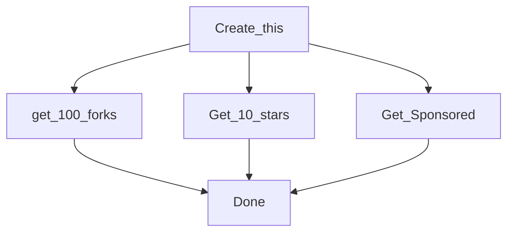

# cool-markdown
Vanilla Markdown Tricks For Much Better README Files, everything you need 

---

## index (so you don’t scroll like crazy)

- [todo](#todo)
- [tricks](#tricks)
  - [permanent link to a code snippet](#permanent-link-to-a-code-snippet)
  - [alerts](#alerts)
  - [todo special](#todo-special)
  - [yaml / jekyll](#yaml-jekyll)
  - [embed gists](#embed-gists)
  - [embed repos](#embed-repos)
  - [diagrams](#diagrams)
  - [maps](#maps)
  - [3d models](#3d-models)
  - [videos](#videos)
  - [math](#math)

future stuff (not yet but will be):
- non-vanilla tricks (profile readme hacks, badges, dynamic stuff, etc.)
- hardcoded components (buttons, cards, fake UI using HTML)

---

### todo
- [x] vanilla MD
- [x] with jekyll
- [x] cool non-vanilla MD but using fancy resources
- [x] profile/project README examples
- [x] simple online editor as github page
- [ ] Future: tiny details README (such as social link decoration, ability to change font)
- [x] add valuable resources list that has readme thingies to add
- [x] Make a file that has README rules to make the file attractive and informative

---

# Tricks

## permanent link to a code snippet
[**How To Get a Link**](https://docs.github.com/en/get-started/writing-on-github/working-with-advanced-formatting/creating-a-permanent-link-to-a-code-snippet)  

```
https://github.com/USERNAME/REPOSITORY/blob/COMMIT_HASH/FILENAME?plain=1#LX-LX
```

> LX-LX = line range (ex: L3-L11)

example:
https://github.com/eymeen/cool-markdown/blob/1279864b0306ea9cf597553d47389276727bf987/README.md?plain=1#L11-L22

---

## Alerts
> [!NOTE]
> Useful info even if you're skimming

> [!TIP]
> makes life easier

> [!IMPORTANT]
> don’t skip this one

> [!WARNING]
> this will bite you later

> [!CAUTION]
> yeah... risky

---

## Todo Special
- [x] #1
- [ ] https://github.com/eymeen/cool-markdown/issues/1
- [ ] https://github.com/eymeen/cool-markdown/pulls/1
- [x] Add delight to the experience when all tasks are complete

when all done:
```
🎉 everything done, go touch grass
```

---

## Yaml, jekyll
Although not 100% vanilla, GitHub Pages lets you do some nice stuff.

```yaml
---
title: cool-markdown
description: markdown tricks
---
```

you can:
- reuse components
- loop stuff
- inject variables
- basically treat markdown like a mini app

---

## embed gists

this DOES NOT work (learned the hard way):
```


```

what actually works:

```html
<script src="https://gist.github.com/USERNAME/GIST_ID.js"></script>
```

or just link it like a normal human:
https://gist.github.com/

---

## embed repos

this one actually works fine, just needed a proper example:

[](https://github.com/eymeen/cool-markdown)

---

## Diagrams
you can create here https://mermaid.live/edit

### Simple

```mermaid
graph TD;
    Create_this-->Get_Sponsored;
    Create_this-->Get_10_stars;
    Create_this-->get_100_forks;
    get_100_forks-->Done;
    Get_10_stars-->Done;
    Get_Sponsored-->Done;
```

---

## Maps

### geojson (Al Quds)
```geojson
{
  "type": "Feature",
  "properties": {
    "name": "Al Quds"
  },
  "geometry": {
    "type": "Point",
    "coordinates": [35.2137, 31.7683]
  }
}
```

### topojson (Mecca)
```topojson
{
  "type": "Topology",
  "objects": {
    "mecca": {
      "type": "Point",
      "coordinates": [39.8579, 21.3891]
    }
  }
}
```

---

## 3D Models (slightly less ugly now)

```stl
solid pyramid
  facet normal 0 0 1
    outer loop
      vertex 0 0 0
      vertex 1 0 0
      vertex 0.5 0.5 1
    endloop
  endfacet
  facet normal 0 1 0
    outer loop
      vertex 1 0 0
      vertex 1 1 0
      vertex 0.5 0.5 1
    endloop
  endfacet
  facet normal 0 0 -1
    outer loop
      vertex 1 1 0
      vertex 0 1 0
      vertex 0.5 0.5 1
    endloop
  endfacet
  facet normal -1 0 0
    outer loop
      vertex 0 1 0
      vertex 0 0 0
      vertex 0.5 0.5 1
    endloop
  endfacet
endsolid
```

---

## videos
<video src="https://github.com/rayytsn9/ROBOTT/assets/79029536/62f541aa-aa8c-43f5-9ead-4b7a2e0d7c2a" width="300" />

---

## Math
$`\sqrt{3x-1}+(1+x)^2`$ 

## Math Blocks
$$\left( \sum_{k=1}^n a_k b_k \right)^2 \leq \left( \sum_{k=1}^n a_k^2 \right) \left( \sum_{k=1}^n b_k^2 \right)$$

---

## resources (actually useful)

- https://github.com/anuraghazra/github-readme-stats
- https://shields.io
- https://readme-typing-svg.herokuapp.com
- https://mermaid.live
- https://carbon.now.sh

---

## README rules (personal opinion)

- don’t make it a wall of text
- people scan, not read
- visuals > paragraphs
- don’t overdo animations (please)
- make it useful, not just “cool”

---

will keep adding random stuff here when I find something worth it
